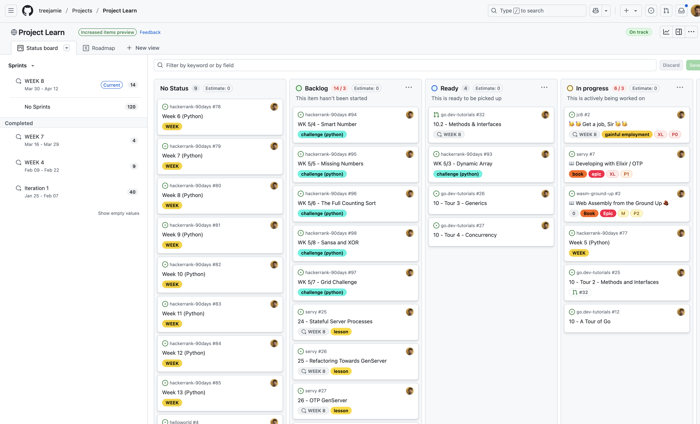

## Hello

I've been involved with the design, development and deployment of web applications and web "stuff" since the late 1990s. Around 2022 I bought an ancient semi-natural woodland (_ASNW_) and spent a few years becoming professionally trained (_NPTC and L3 Arb_) in arboriculture, woodland management and forestry. [Since then I've been spending my time working on/in/up trees (_body_) and writing/deploying code (_mind_)](https://treesandcode.substack.com/). I am in possession of a happy spirit thanks to trees and code. 

[I am currently seeking gainful employment.](https://github.com/users/treejamie/projects/2/views/2?sliceBy%5Bvalue%5D=WEEK+8&pane=issue&itemId=103378525&issue=treejamie%7Cjc6%7C2)

## Project Learn

I've got an [active Github project](https://github.com/users/treejamie/projects/2) where you can see what I'm up to. I've tried to keep the project in sprints so you can see that "know what I'm doing" when working in as a software person in a team of people. CI/CD is baked into all my repos through Github actions. Web stuff deploys via Docker images to various locations.

Before I went to a backend only role in 2015 I was full stack. I miss that, so I'm spending time on JavaScript / TypeScript and the various ecosystems of libraries and frameworks that surround the modern frontend. Backend wise, i'm concentrating on learning Go, Rust and understanding web assembly. I've also been noticably focused on web contexts in my career so far and I'm quite excited to get into some app development. Particularly for some Tree Surveying ideas that I have. You'll find those under my companies source code - [Trees and Code](https://github.com/trees-and-code)

## Skills

 ⚠️ This is a long section, so I have collapsed it as a default. This list has taken me over 27 years of career to develop. For the next 20 years of my career away from trees, I am specifically interested in programming / development roles. I climb trees now, not career ladders.

## 🛠️ "Hard" Technical Skills

### Backend

#### Python

#### Elixir

#### Go / Rust

### Frontend

#### TypeScript

#### JavaScript

### Frameworks / Libraries

#### Django

#### Fast API

#### Phoenix

#### Next.js

### Documentation / Collaboration

#### Sphinx / Read The Docs / SSG's

#### OpenAPI / Swagger

#### ♥️ Elixir (@moduledoc, @doc, @typedoc)

#### Confluence / Notion

### Continous Integration (CI) / Continous Deployment (CD)

#### Jenkins

#### Github Actions

#### Makefiles 😕

#### Circle CI / <insert provider name here>

### Databases / Queues

#### PostgreSQL

#### MySQL / Maria

#### Redis

#### Memcached

#### RabbitMQ

## 💾 "Soft" Technical Skills

### Source Code Management

#### git

#### github workflow

#### Subversion

#### CVS 😱

### Workflow

#### Waterfall

#### Kanban

#### Agile

#### Sprint

#### Lean / MVP

### Testing

#### Unit / Integration Tests

#### ♥️ Elixir - doctest

#### Smoke Tests / End to End

#### External Services

#### Penetration Testing

#### Security Scanning

### Performance

#### Newrelic / App Monitoring

#### CLI

## ⚖️ Governance

### Information Security

#### Red / Blue / Purple Team

### Data Protection

#### UK Data Protection Act

#### GDPR

#### Global Data Protection Landscape

### Cyber Security

#### Fleet Management

#### BYOD

#### Lifecycle

### ISO 27001 / SOC II

#### Gap Analysis

#### Risk Posture

#### Implementation

### Vendor Security Assessments

#### Preparation

#### Evidence

#### Navigating Procurement Channels

#### Assessing your own supply chain

## 🧑‍💼 Soft Skills

### Communication 

#### Written

#### Audio

#### Video

#### In-person

### Hiring / Firing

#### Hiring and recruitment managing

#### Letting people go - an awful business.

## CV

My CV is available by request, drop me an email to [jamie@curle.io](mailto:jamie@curle.io) if you'd like to ask for copy.

